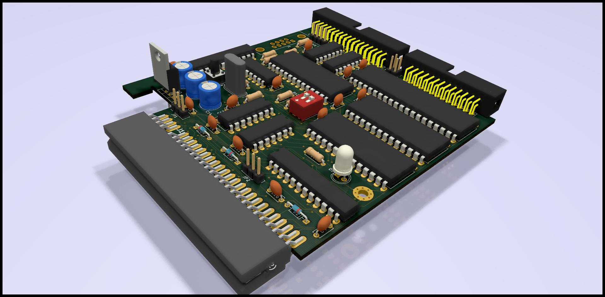
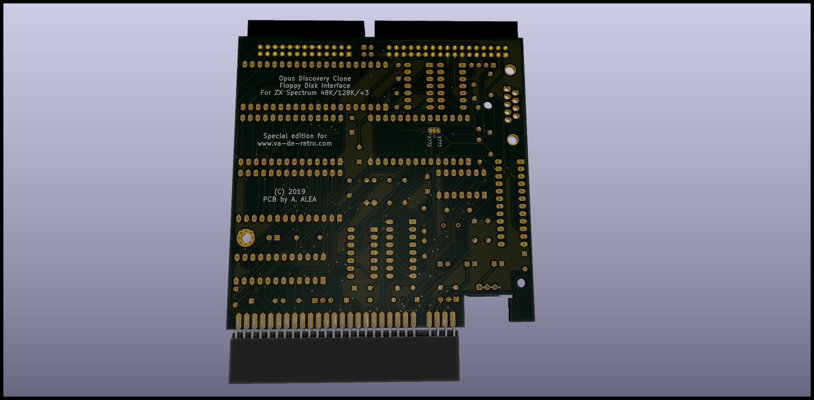
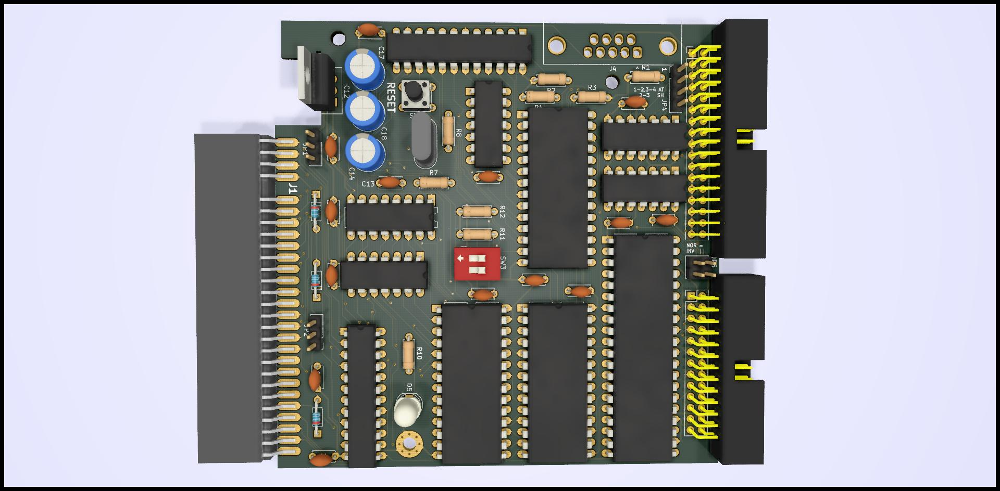

# The Opus Discovery mini-clone Disk Interface for ZX Spectrum
the schematic and PCB for this interfaz, make in KICAD
target is to have a PCB is less than 10x10cm so it's very cheap.

WARING - THIS IS WORK IN PROGRESS - NOT TESTED

The Advantage of this interfaz over the original are:

- 4 Banks of ROM, so you can swap between original ROM and Quickdos, selectable by dip-switches

- Included Fixed for +2A/+3, so can be used in any ZX Spectrum, selection by jumpers

- Reset Button

- Posibility of use crossed and plain floppy cable, and invert Drive 1 and Drive 2, very usefull if you have a Gotek and a real floppy.

